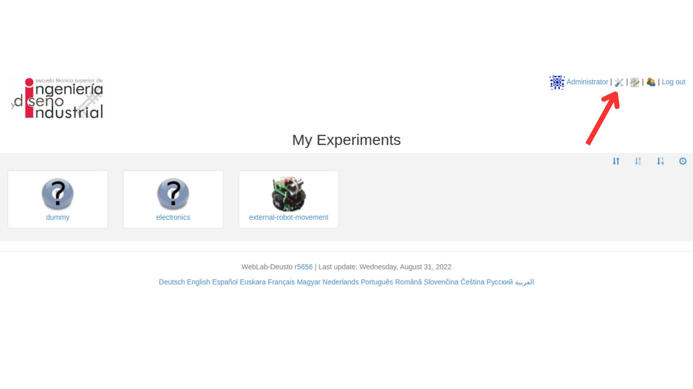
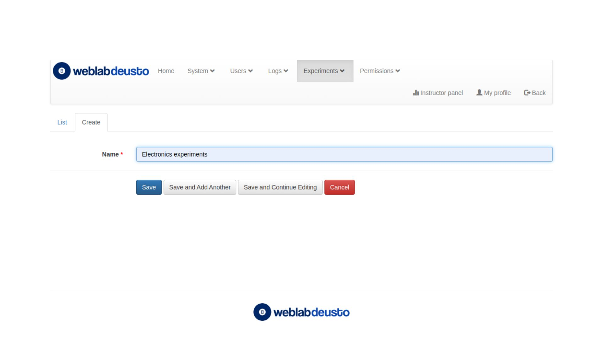

# WEBLABDUSTO
## Estructura del proyecto
Una vez realizamos la instalación de WebLabDeusto como se indica en el [readme de instalación](installation.md) debemos comprender su estructura para poder utilizarlo. En este apartado explicaremos la estructura de carpetas que se crea una vez creamos una instancia y además, se explicarán como funcionan los scripts claves que deben ser modificados para hacer funcional nuestro laboraotorio y poder vincular nuestro experimento.
### Directorio
```
/project-root
│
├── 📄 `configuration.yml`            				→ Definición de la arquitectura de procesos y componentes del sistema
├── 📄 `core_host_config.py`          				→ Configuración de base de datos, sesiones y coordinación del core
├── 📄 `debugging.py`                 				→ Configuración para la monitorización con WebLab Bot
├── 📄 `deleteExamplesExperiments.py` 				→ AÑADIDO: Elimina experimentos de la base de datos
├── 📄 `lab1_config.py`               				→ Asocia experimentos y define su conexión con el core
├── 📄 `run.py`                      	 			→ Arranque de la instancia
├── 📄 `weblab.pid`                   				→ Almacena ID del proceso
├── 📁 `client/`
│   └── 📁 `images/`
│       └── 📄 `logo.jpg`                                  
│       └── 📄 `logomobile.jpg`                             
├── 📁 `db/`
│   └── 📄 `WebLab.db`                   			    → Base de datos principal: usuarios, sesiones y experimentos
│   └── 📄 `WebLabCoordination.db`      				→ Base de datos para coordinación entre laboratorios
├── 📁 `files_stored/`
│   └── 
├── 📁 `httpd/`
│   └── 📄 `apache_weblab_generic.conf` 				→ Configuración para servidor Apache que sirve la instancia
│   └── 📄 `simple_server_config.py`    				→ Configuración de un servidor web simple alternativo
├── 📁 `logs/`
│   └── 📁 `config/`
│   .   └── 📄 `logging.configuration.experiment.txt`       	→ Configuración de logs para experimentos
│   .   └── 📄 `logging.configuration.laboratory1.txt`     	    → Configuración de logs para el laboratorio 1
│   .   └── 📄 `logging.configuration.server1.txt`          	→ Configuración de logs para el servidor central
├── .
│   └── 📄  "multiple example logs"                         	→ Ejemplos de otros logs no configurados
├── 📁 `pub/`
│   └── 
```
Observando el árbol del directorio podemos ver que a parte de los archivos principales que se describen en detalle más adelante, existen varias carpetas que organizan los distintos componentes y recursos del sistema. En la carpeta `client/` se encuentran los recursos estáticos para web, en este caso las imágenes de los banners en la interfaz. En `db/` se encuentran las bases de datos en `SQLite`, donde se almacena la información de usuarios y sesiones activas y los datos de los experimentos, estas son indispensable spara el correcto funcionamiento del laboratorio. Por otro lado, en `files_stored/` se almacenarían archivos que subiesen los usuarios, aunque se encuentra vacía porque en el único experimento que se ha desarrollado no se hace uso de ella, pero se mantiene por si en algún momento se desea aprovechar este despliegue para desarollar otros laboratorios que puedan necesitarla. `http/`contiene los archivos de configuración web que permiten servir la aplicación y los recursos asociados, estos se crean y configuran automáticamente cuando se realiza la instancia. Seguidamente encontramos la carpeta `logs/`, los tres archvios dentro de `config/` están configurados y cada uno se encarga de mostrar los logs que su nombre indica, luego, bajo el nombre "multiple example logs" se simbolizan otros archivos log incluidos en la instancia pero que no están configurados y por tanto no muestran nada; los logs que si están configurados muestran un registro completo de lo que va ocurriendo y facilitan el diagnóstico en caso de error. Por último, en la carpeta `pub/` se encontrarían los recursos públicos o compartidos, que no han sido necesarios, pero se mantiene su presencia por si se añadiesen más experimentos.

A continuación, se procede a describir el funcionamiento más detallado de aquellos archivos que debemos de modificar y por tanto tenemos que comprender.
#### configuration.yml

En `configuration.yml` se definen los procesos que se ejecutan, cómo se organizan sus componentes y cómo se relacionan entre sí. La jerarquía parte del core_host y a partir de ahí se detallan los procesos que se ejecutan dentro de él, para ello se describen sus componentes, siendo estos procesos del core y de los laboratorios. Parte de la configuración de los procesos del core son el puerto y la ruta. En la configuración de los procesos de los laboratorios se utiliza el archvio `lab1_config.py` para definir la configuración adicional del `laboratory1` y además definimos dentro de este los experiementos que tengamos, originalmente apareceerán los incluidos en la instalación y luego añadiremos el nuestro definiéndolo como un `HttpExperiemnt` conectado a un servidor web local con credenciales específicas (esto es lo que definimos en `http_experiment_url`, `http_experiment_username` y `http_experiment_password`). En resumen, este archivo permite desacoplar los elementos del sistema y desplegar componentes de forma flexible, haciendo posible la escalabilidad horizontal del sistema, es decir, añadir más laboratorios o núcleos.

#### core_host_config.py
`core_host_config.py` es la configuración interna del servidor central del sistema, gestiona recursos, sesiones, coordinación y almacenamiento. Define la conexión a las bases de datos (WebLab.db y WebLabCoordination.db) especificando usuario, contraseña y ubicación. Establece también parámetros generales del servidor como el modo debug, la dirección del host, la forma en que se gestionan las sesiones o la definición del tiempo de espera. Al final del script se encuentran dos funcniones claves, `core_coordinator_laboratory_servers` y `core_scheduling_systems`, en estas se especifica cómo el core se comunica con los laboratorios registrados y cómo se gestionan las colas de experimentos, respectivamente

#### lab1_config.py
`lab1_config.py` sirve como nexo de unión entre el laboratorio físico y el sistema WebLab-Deusto. Define qué experimentos ofrece este laboratorio (`Etiqueta:nombre del experimento@nombre de la categoría`) y cómo deben coordinarse con el core. Se especifica el identificador de coordinación `coord_address` donde debe utilizarse la estructura `componente:proceso@host`, los protocolos que utiliza y la API que implementa. Gracias a este archivo, el core puede programar sesiones de laboratorio y asignarlas al experimento físico adecuado. También permite la coexistencia de múltiples laboratorios en un mismo entorno de despliegue, siempre que cada uno tenga su propio archivo de configuración y puerto definido. Este archivo es esencial para mapear la infraestructura física con su representación lógica en WebLab.

#### deleteExamplesExperiments.py
Por último, `deleteExamplesExperiments.py` es un script adicional, que se ha creado con la intención de poder eliminar los expeimentos que ya vienen incluidos en la propia instancia de `WebLabDeusto`. Este script se crea debido a que, si bien en la interfaz de `WebLabDeusto` hay un apartado destinado a la eliminación de experimentos y categorías, cuando se intenta utilizarlo, salta un error en la base de datos debido a que se pretenden eliminar una serie de parámetros sin tener en cuenta las relaciones que tienen con otros. Este script es necesario para poder realizar una eliminación en cascada y así eliminar todo rastro de los experimentos en la base de datos sin que queden residuos en otras partes de ella. El script permite definir una lista de IDs de experimentos `EXPERIMENT_IDS_TO_DELETE` que serán eliminados de todas las tablas relacionadas: `ExperimentClientParameter`, `ExperimentInstance` y `UserUsedExperiment`. Finalmente, elimina el experimento en sí. Utiliza el módulo sqlite3 para conectarse y ejecutar comandos SQL. 

**Es importante que se modifique cuando se quiera utilizar y que para ello se consulte en la base de datos los ID's de los experimentos que se quieren eliminar.**

## Despliegue
Primeramente se crea un despliegue, dentro del entorno virtual con:
```bash
$ weblab-admin create example
```
Una vez configurado el laboratorio debe ser añadido al *deployment* de **WebLab**, para ello lo único que hay que hacer es: 

1. Modificar el archivo `configuration.yml` para vincular el experimento al laboratorio: 
```yml 
    electronics:
            class: experiments.http_experiment.HttpExperiment
            config:
              http_experiment_url: http://localhost:5000/ # dirección del experimento
              http_experiment_username: weblabdeusto # WEBLAB_USERNAME
              http_experiment_password: secret # WEBLAB_PASSWORD
            type: experiment
```
2. Modificar el archivo `lab1_config.py` para registrar el experimento en el laboratorio del servidor:
```py
    laboratory_assigned_experiments = {
        'exp1:dummy@Dummy experiments' : {
                'coord_address' : 'experiment1:laboratory1@core_host',
                'checkers' : (),
                'manages_polling': True,
            },
        # Experimento añadido
        'exp1:electronics@Electronics experiments' : {**
               'coord_address' : 'electronics:laboratory1@core_host',
                'checkers' : (),
                'api'      : '2',
            },
    }
```
`exp1:electronics@Electronics experiments`: Identificador del experimento en el servidor del laboratorio *etiqueta:nombre del experimento@nombre de la categoría*
`electronics:laboratory1@core_host`: Identificador del experimento para **WebLab** *componente:proceso@host*

3. Modificar el archivo `core_host_config.py` para registrar un scheduling para el laboratorio:
   *Hay tener en cuenta que los nombres que utilicemos para registrar el laboratorio deben coincidir con el que se ha utilizado en `lab1_config.py`, además, la estructura `exp1|electronics|Electronics experiments` es muy importante para luego poder vincular correctamente el laborario en la web*
```py
    core_scheduling_systems = {
            'dummy_queue'       : ('PRIORITY_QUEUE', {}),
            'robot_external'    : weblabdeusto_federation_demo,
            # Añadimos la cola al sistema de planificación
            'electronics_queue' : ('PRIORITY_QUEUE', {}),
    }

    core_coordinator_laboratory_servers = {
        'laboratory1:laboratory1@core_host' : {
                'exp1|dummy|Dummy experiments'       : 'dummy1@dummy_queue',
                # Creamos la cola asociada al experimento 
                'exp1|electronics|Electronics experiments' : 'electronics1@electronics_queue',
            },
    }
```
`exp1|electronics|Electronics experiments`: *etiqueta|nombre del experimento|categoría del experimento*

4. Lanzar el *deployment* de *WebLab-Deusto*
```bash
$ weblab-admin start example
```
5. Iniciar sesión con el usuario y contraseña de administrador

6. Crear una nueva categoría a corde al nombre que se eligió anteriormente
    1. 
    2. 
7. Crear un nuevo experimento, en la categoría que se acaba de crear, que tenga el mismo nombre que el elegido anteriormente
   1. 
   2.  Como cliente se selecciona `redirect`
   
