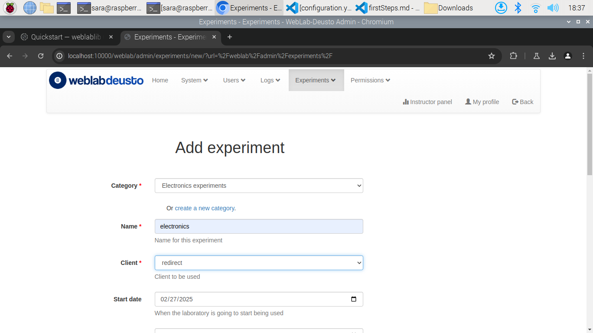

# WEBLABDEUSTO
## Estructura del Proyecto
```
/project-root
│
├── 📄 `configuration.yml`                                  → xx
├── 📄 `core_host_config.py`                                → xx
├── 📄 `debugging.py`                                       → xx
├── 📄 `deleteExamplesExperiments.py`                       → xx
├── 📄 `_file_notifier`                                     → xx
├── 📄 `lab1_config.py`                                     → xx
├── 📄 `run.py`                                             → xx
├── 📄 `weblab.pid`                                         → xx
├── 📁 `client/`
│   └── 📁 `images/`
│       └── 📄 `logo.jpg`                                   → xx
│       └── 📄 `logomobile.jpg`                             → xx
├── 📁 `db/`
│   └── 📄 `WebLab.db`                                      → xx
│   └── 📄 `WebLabCoordination.db`                          → xx
├── 📁 `files_stored/`
│   └── 
├── 📁 `httpd/`
│   └── 📄 `apache_weblab_generic.conf`                     → xx
│   └── 📄 `simple_server_config.py`                        → xx
├── 📁 `logs/`
│   └── 📁 `config/`
│   .   └── 📄 `logging.configuration.experiment.txt`       → xx
│   .   └── 📄 `logging.configuration.laboratory1.txt`      → xx
│   .   └── 📄 `logging.configuration.server1.txt`          → xx
├── .
│   └── 📄  "multiple example logs"                         → xx
├── 📁 `pub/`
│   └── 
```
A continuación se proceden de describir los diferentes scripts que son modificados en el desarrollo y cuya comprensión de su funcionamiento es vital para la comprensión del laboratorio.

### configuration.yml


### core_host_config.py


### deleteExamplesExperiments.py


### lab1_config.py


## Despliegue
Primeramente creamos nuestro despliegue, dentro del entorno virtual con:
```bash
$ weblab-admin create example
```
Una vez configurado el laboratorio debe ser añadido al *deployment* de **WebLab**, para ello lo único que tenemos que hacer es: 

1. Modificar el archivo `configuration.yml` para vincular nuestro experimento al laboratorio: 
```py
    electronics:
            class: experiments.http_experiment.HttpExperiment
            config:
              http_experiment_url: http://localhost:5000/ # dirección del laboratorio
              http_experiment_username: weblabdeusto # WEBLAB_USERNAME
              http_experiment_password: secret # WEBLAB_PASSWORD
            type: experiment
```
2. Modificar el archivo `lab1_config.py` para registrar nuestro experimento en el laboratorio del servidor:
```py
    laboratory_assigned_experiments = {
        'exp1:dummy@Dummy experiments' : {
                'coord_address' : 'experiment1:laboratory1@core_host',
                'checkers' : (),
                'manages_polling': True,
            },
        # Experimento añadido
        'exp1:electronics@Electronics experiments' : {**
               'coord_address' : 'electronics:laboratory1@core_host',
                'checkers' : (),
                'api'      : '2',
            },
    }
```
`exp1:electronics@Electronics experiments`: Identificador del experimento en el servidor del laboratorio *etiqueta:nombre del experimento@nombre de la categoría*
`electronics:laboratory1@core_host`: Identificador del experimento para **WebLab** *componente:proceso@host*

3. Modificar el archivo `core_host_config.py` para registrar un scheduling para nuestro laboratorio:
   *Debemos tener en cuenta que los nombres que utilicemos para registrar nuestro laboratorio deben coincidir con el que hemos utilizado en `lab1_config.py`, además, la estructura `exp1|electronics|Electronics experiments` es muy importante para luego poder vincular correctamente el laborario en la web*
```py
    core_scheduling_systems = {
            'dummy_queue'       : ('PRIORITY_QUEUE', {}),
            'robot_external'    : weblabdeusto_federation_demo,
            # Añadimos la cola al sistema de planificación
            'electronics_queue' : ('PRIORITY_QUEUE', {}),
    }

    core_coordinator_laboratory_servers = {
        'laboratory1:laboratory1@core_host' : {
                'exp1|dummy|Dummy experiments'       : 'dummy1@dummy_queue',
                # Creamos la cola asociada al experimento 
                'exp1|electronics|Electronics experiments' : 'electronics1@electronics_queue',
            },
    }
```
`exp1|electronics|Electronics experiments`: *etiqueta|nombre del experimento|categoría del experimento*

4. Lanzar el *deployment* de *WebLab-Deusto*
```bash
$ weblab-admin start example
```
5. Iniciar sesión con nuestro usuario y contraseña de administrador

6. Crear una nueva categoría a corde al nombre que elegimos anteriormente
    1. 
    2. 
7. Crear un nuevo experimento, en la categoría que acabamos de crear, que tengo el mismo nombre que elegimos anteriormente
   1. 
   2.  Como cliente seleccionaremos `redirect`
   
