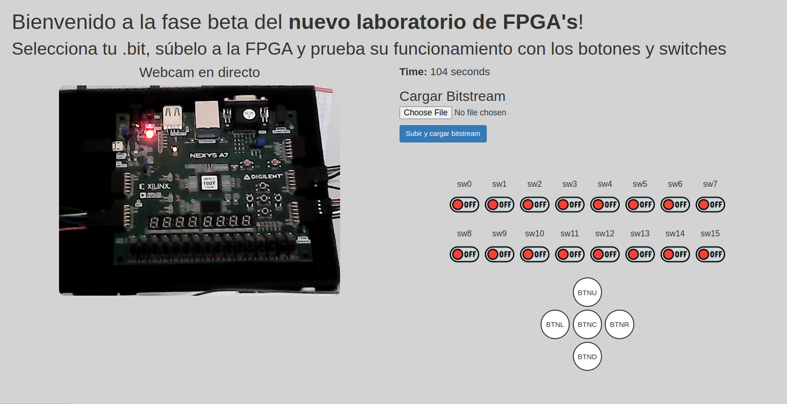

# WEBLABLIB
## Estructura del Proyecto
Antes de leer este documento, seguir los pasos detallados en el [readme de instalación](installation.md)

El desarrollo del laboratorio remoto con WebLabLib se organiza en distintas etapas. Cada una corresponde a la creación y configuración de archivos específicos dentro de una estructura de carpetas que facilita la modularidad y el mantenimiento del código.

La estructura del proyecto no es compleja, está compuesta de cuatro scripts principales, adicionalmente se ha creado una carpeta de documentación, pero no forma parte de la estructura principal:

```
/project-root
│
├── 📄 `laboratory.py`       → Backend principal (configuración de la aplicación Flask)
├── 📄 `hardware.py`         → Control hardware
├── 📁 `templates/`
│   └── 📄 lab.html          → Interfaz de usuario
├── 📁 `static/`
│   └── 📄 lab.js            → Frontend
├── documentation/
│   └── 📄 installation.md   → Readme principal de instalación
│   └── 📄 furtherSteps.md   → Readme descritivo del código
```

#### hardware.py
En `hardware.py` se desarrollan las funciones necesarias para controlar la FPGA desde el laboratorio. Se mapean los GPIO que se van a utilizar y que están conectados físicamente a la FPGA, los 16 interruptores y los 5 botones. En él se usan los decoradores `@weblab.on_start` y `@weblab.on_dispose` para frozar que las funciones `start` y `clean` se ejecuten en unas condiciones concretas; al iniciar y al finalizar o reiniciar el programa, resectivamente. 

La función `start` se encarga de configurar los pines como salida y los inicializa a nivel bajo; `dispose` se encarga de realizar la limpieza de recursos, poniendo los interruptores a 0 en el json y limpiando los GPIO; para el control de los interruptores se usan dos funciones, `switch_switches` enciende o apaga los interruptores en base a lo que tenga escrito el json y lo actualiza, y por otro lado, `is_switch_on` lee el estado de un interruptor en el json; por otro lado, para los botones se plantea una lógica diferente, en lugar de leer su estado, se simula la pulsación con un pulso de 200ms mediante la función `send_pulse`; finalmente, para realizar la subida del bitstream a la FPGA la función `upload_bitstream` se encarga de crear un archivo temporal .bit cuy contenido es el archivo que ha subido el usuario a través de la interfaz web, el cual sube a la placa haciendo uso de OpenFPGALoader y más tarde elimina para no consumir recursos de más.

#### laboratory.py
`laboratory.py` es el backend del laboratorio, en él se usa Flask y WebLabLib para crear la aplicación web que permite utilizar las funciones de `hardware.py` desde el navegador. En este caso, se utilizan los decoradores `@requires_login` y `@requires_active` para verificar el login y la validez de la sesión respectivamente, de esta manera se asegura de que existe un usuario activo válido.

Con `app.config.update` se configuran los parámetros de WebLab, es importante tomar especial precaución en qué se introduce en estos parámetros ya que más tarde serán los que utilicemos en el archivo `configuration.yml` del deployment de WebLab para vincular el experimento al laboratorio.
```py
    'WEBLAB_USERNAME': 'weblabdeusto',
    'WEBLAB_PASSWORD': 'secret',
```
Luego se define como ruta principal (/) `lab.html` y la se sirve como interfaz web a los usuarios autenticados. Adicionalmete se usan otras rutas como: `/status`, que devuelve en un JSON el estado de los 16 interruptores, el tiempo restante de sesión y posibles errores; `/poll` mantiene activa la sesión del usuario; `sw/<int:number>/` se encarga de gestionar el control de los interruptores, enviando o no una señal a través de los GPIO's usando la función `switch_switches` de `hardware.py`, cosa que puede hacer ya que obtiene su estado con la función `get_switch_status` que usa a su vez la función `is_switch_on` de `hardware.py`; `/pulse/<int:pin_id>` se encarga de simular la pulsación de los botones usando la función `send_pulse` de `hardware.py`; por último, `/upload-bitstream` permite subir el .bit desde el frontend, cuando se recibe un archivo correcto, se pasa su contenido a `upload_bitstream` de `hardware.py` y este es quien se encarga de subirlo a la placa, es importante matizar que no se pasa el archivo completo sino su contenido y se almacena en el archivo temporal que ha creado la función en `hardware.py`.

Adicionalmente se crea un comando CLI manual, que permite que el usuario lo ejecute desde consola, este se crea con el objetivo de poder hacer uso desde consola de la función `clean_resources` de `hardware.py` en caso de que fuese necesario.

#### templates/lab.html
`lab.html` es la interfaz web que ve el usuario que accede al experimento y con la que interacciona a través del frontend. Está diseñada haciendo uso de HTML, CSS y Bootstrap para estructurarla y darle formato y ademas se usa Jinja2 para renderizar los elementos dinámicos, es decir, aquellos que cambian durante el trascurso de la sesión.

El código desarrollado en gran parte se encarga de estructurar visualmente la web, colocando una serie de textos en la parte superior y debajo de estos "crea dos columnas" de manera que la webcam en directo queda en el lado izquierdo y en el lado derecho se muestra el temporizador, el formulario para subir el bitstream, los interruptores y los botones. También se incluye la muestra de un mensaje de fin de sesión cuando termina el tiempo asignado al usuario. En la parte inferior del script se encuentran las declaraciones necesarias para la carga de scripts externos: jQuery, Bootstrap y nuestro frontend, lab.js. Es reseñable destacar que la webcam no se encuentra integrada en el laboratorio directamente sino que se publica la imageb en otra dirección a la cuál se accede desde este script.


#### static/lab.js
`lab.js` es el frontend del laboratorio, es decir, el código que se ejecuta en el navegador y que permitirá al usuario interaccionar con la FPGA. Este se encargará de gestionar los eventos, interruptores, botones, la cuenta atrás y la carga del bitstream; esto lo hace a través de peticiones al backend (`laboratory.py`).

Las funciones `turnOn` y `turnOff` envían peticiones a través de `turnswitch` al backend para de esta manera actualizar el estado de los interruptores en el servidor, ambién se hace uso de la función `paseStatus` que muestra el estado real de los interruptores mostrando y ocultando las imágenes deseadas dependiendo de si el iterruptor está encendido o apagado. Por otro lado, los botones se gestionan mediante `sendPulse` que envía una petición al backend para que simule la pulsación en el pin deseado. La carga del bitstream se hace a través de un formulario HTML, cuando el usuario selecciona un archivo .bit y lo envía se intercepta el formulario, se crea un objeto `FormData`con el contenido del .bit y se envía al backend para que pueda ser subido a la FPGA, luego se obtiene un mensaje de éxito o error a través de un json que se muestra en pantalla al usuario. Para actualizar la interfaz en tiempo real y que la experiencia de usuario sea lo mejor posible, se implemementa un sistema de sincronización que cada 1000ms hace una petición al servidor para obtener el estado de los switches y del temporizador, de esta manera, se controla el tiempo disponible y se muestra y una vez finaliza se cierra la sesión del usuario y se le notifica, esta petición se hace también a través de `parseStatus` ya que no solo se encarga de mostrar las imágenes obteniendo la información de los interruptores del json, sino que obtiene el `TIME_LEFT` de él. 


## Descriptivo de las funcionalidades propias del laboratorio
En este apartado se describen las características añadidas para que el laboratorio esté completo y puedan ser utilizadas todas las funcionalidades deseadas de la placa de desarrollo que se encuentra conectada. Parte del código utilizado, como se verá más adelante, deriva del código de ejemplo que la propia librería WebLabLib nos ofrece en su [documentación](https://developers.labsland.com/weblablib/en/stable/quickstart.html), es por ello que en las explicaciones se contextualizan las modificaciones hechas, esto se incluye para facilitar la comprensión del código y que pueda servir de guía para el desarrollo de otros laboratorios que tengan un funcionamiento similar aunque no igual.

### Implementación de los switches
Para la configuración de los switches de la FPGA se utilizan, modificádolas, las funciones dadas en la documentación en el ejemplo [del encendido de bombillas](https://github.com/weblabdeusto/weblablib/tree/master/examples/quickstart/step2), estos se ajustan para que sean 16 interruptores, que son los que tiene la Nexys 4 DDR, modelo que estamos utilizando para este experimento.

Además, se implementa el envío de impulsos a través de los GPIO de la Raspberry Pi en la que se ejecuta el servidor. Para poder hace uso de los GPIO se importa la librería `RPi.GPIO` en `hardware.py` y se modifican las funciones necesarias para hacer uso de estos; por ejemplo, en `switch_switches` se añade la conmutación del estado del GPIO en función de la lectura del json y también se crea la función `start` donde se procede a la incialización de los GPIO como salida y a nivel bajo.
Adicionalmente se modifica `lab.html` para implementar los switches en la web y se modifica la función `parseStatus` del javaScrip para contemplar todos los switches y se añade la cuenta regresiva del temporizador.

### Implementación de los botones
Al contrario que con los switches, los botones no necesitan conocer su estado anterior ya que simplemente pueden modelarse como un impulso con una duración en milisegundos (se ha ajustado a 200ms pero se podría variar la duración). Por lo que su implementación es más sencilla y no es necesario que se actualice el `.json`. Para su funcionamiento se ha optado por la creación de la función `send_pulse` en `hardware.py` que como su nombre indica se encarga de envíar un pulso de 200ms a través del GPIO deseado, que funciona conjuntamente con la función `pulse` en `laboratory.py`, la función `sendPulse` de `lab.js` y la implementación de los botones en la web en `lab.html`

### Implementación de la carga del bitstream
Como trabajo previo al desarrollo de este laboratorio se experimentaron diferentes maneras de cargar el bitstream a la FPGA sin necesidad de grandes interacciones. Inicialmente se probó a cargarlo haciendo uso de un script Batch Tcl pero esto era demasiado lento para implementarlo en un laboratorio por turnos ya que la velocidad del ***Vivado*** a la hora de realizar tareas depende mucho de la potencia de la máquina en la que esté instalado, por otro lado, tampoco es la mejor opción ya que para utilizar este tipo de script es necesario instalar el ***Vivado***y es un programa que ocupa mucho espacio. Finalmente se optó por hacer uso de una herramienta de software libre llamada ***Open FPGA Loader***, esta aplicación es universal ya que es compatible con numerosas placas y cables de transmisión de datos y puede instalarse desde su github [trabucayre/openFPGALoader](https://github.com/trabucayre/openFPGALoader).

Finalmente se ha optado por implementar dentro del experimento el script externo que teníamos, para ello se crea la función `upload_bitstream`, en `hardware.py`. Para cargar el bitstream se almacena temporalmente el contenido del archivo subido por el usuario y posteriormente se elimina una vez se ha completado la carga, de esta manera se evita que se consuman recursos en exceso. Además, para que el usuario pueda interaccionar con esta funcionalidad, en el laboratorio se implementa un botón para subir los archvios, esta interacción se encuentra definida en `lab.html`. Por otro lado, en `laboratory.py` la función `upload_bitstream` se encarga de recibir el `.bit` y enviarlo a través de la función de `hardware.py` a la **FPGA**, a su vez en `lab.js` hay una parte del código destinada a la carga del bitstream que permite subir el archivo al servidor sin necesidad de recargar la página.

### Implementación de la cámara en directo
Se comparan diferentes posibilidades para implementar una cámara en directo en una página web y finalmente se encuentra OpenCV, el problema es que OpenCV no funciona en python 2 por lo que hay que hay que hacer uso de la aplicación en un script fuera del entorno virtual del laboratorio, ejecutar el servicio desde fuera también y luego insertar una etiqueta dentro de nuestro laboratorio. El código que hay en el script `camera.py` se adjunta aquí, pero hay que tener en cuenta, como se comentaba antes, que es un archivo que debe de ir fuera del entorno virtual en el que está `Weblablib` o en el que esta `WebLabDeusto`
```py
from flask import Flask, Response
import cv2

app = Flask(__name__)

camera = cv2.VideoCapture(0) #Select the first camera conected

def generate_frames():
    while True:
        success, frame = camera.read()
        if not success:
            break
        ret, buffer = cv2.imencode('.jpg', frame)
        frame = buffer.tobytes()
        yield (b'--frame\r\n'
               b'Content-Type: image/jpeg\r\n\r\n' + frame + b'\r\n')

@app.route('/video_feed')
def video_feed():
    return Response(generate_frames(),
                    mimetype='multipart/x-mixed-replace; boundary=frame')

if __name__ == '__main__':
    app.run(host='0.0.0.0', port=5001)
```

#### Problemas asociados
En un futuro, cuando el laboratorio sea subido a la web habrá que hacer acesible el vídeo y para ello se tendrá que decidir si se sigue haciendo uso de OpenCv combinado con otras herramientas, como por ejemplo una VPN entre servidor y Raspberry Pi o un túnel SSH. También se podría plantear enviar el vídeo en streaming a través de YouTube, esta opción no es muy privada, aunque no debería de ser un problema ya que la imagen que se retransmite no da ningún tipo de información comprometida. 

