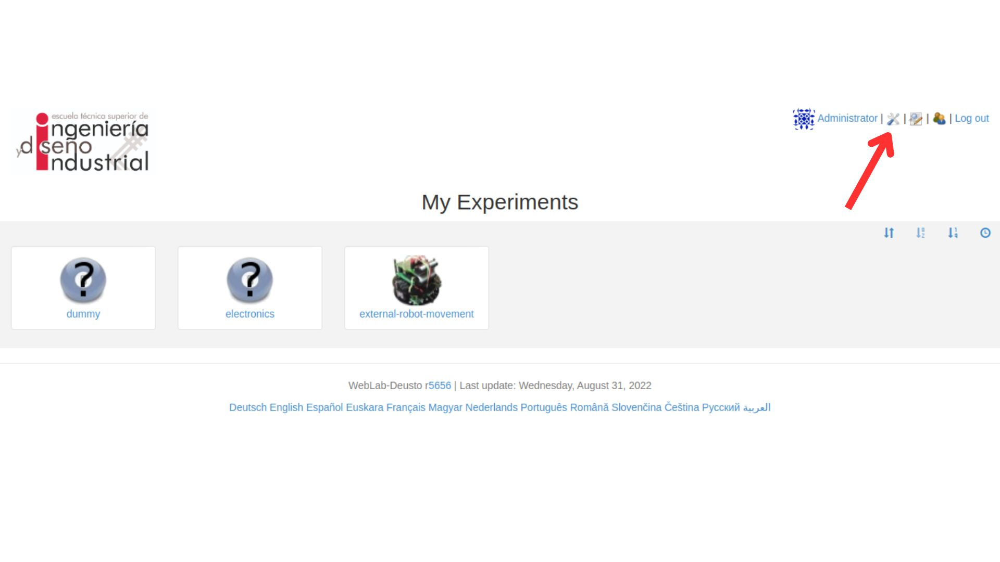
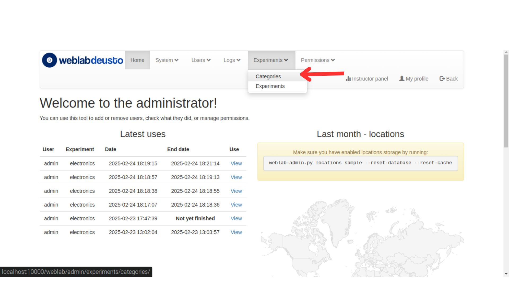
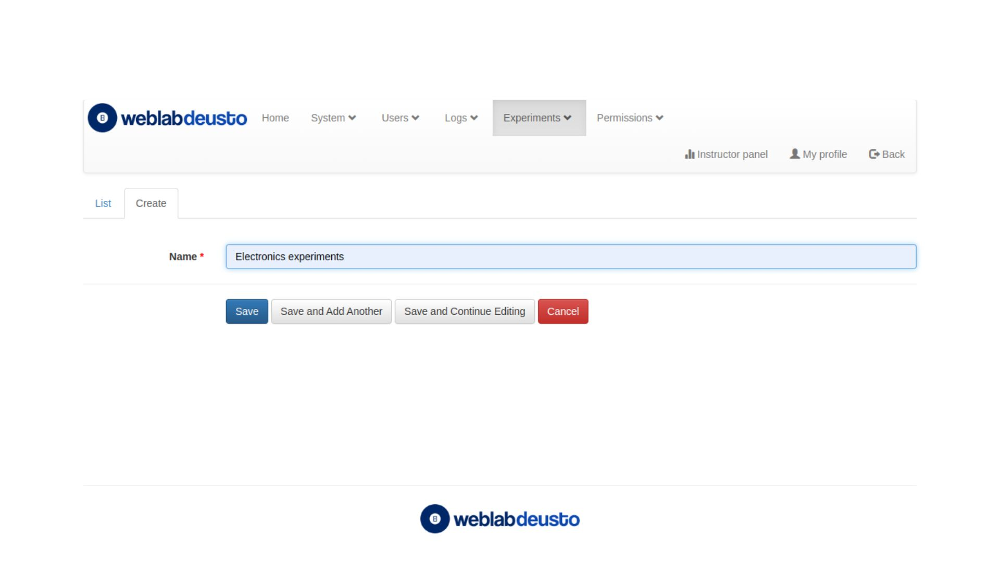
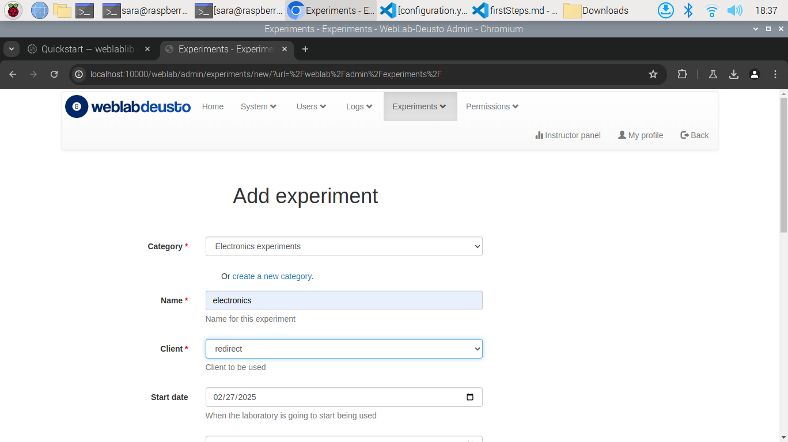

## **Introducción**
Lo primero que vamos a hacer es organizar el entorno para así poder comprender la estructura y cómo se comunican los diferentes módulos.
Antes de nada, debemos comprender las herramientas que vamos a utilizar:

**WebLabLib** es una biblioteca en Python que facilita la creación de laboratorios no gestionados en **WebLab-Deusto**. Se basa en **Flask** y ofrece herramientas para manejar la autenticación, la comunicación con el servidor y la gestión de sesiones de los usuarios. Su principal ventaja es que permite desarrollar laboratorios personalizados sin depender de la infraestructura de WebLab-Deusto, lo que da mayor flexibilidad a la hora de diseñar el sistema. Al estar basado en Flask, proporciona una estructura sencilla para definir rutas y manejar peticiones HTTP, además de integrar **Flask-SocketIO** para la comunicación en tiempo real y **Flask-SQLAlchemy** para gestionar bases de datos de forma eficiente.  

Por otro lado, **WebLab-Deusto** es una plataforma de código abierto para la gestión de laboratorios remotos, es quien nos permitirá acceder a través del laboratorio a la FPGA. Incorpora funcionalidades como autenticación, control de acceso, programación de sesiones y administración de recursos. En nuestro caso, el laboratorio lo desarrollaremos mediante WebLabLib como se comenta en el párrafo anterior, para así no depender de la infraestructura central de WebLab-Deusto (que en anteriores pruebas ha dado errores que no se han podido solucionar). En resumen, Weblab-Deusto se encargará de realizar la gestión de usuarios y sesiones.  

Al final, tendremos un laboratorio desarrollado en **WebLab-Deusto** que estará desplegado inicialmente en la dirección local localhost/8000 y por otro lado tendremos un experimento desarrollado con **WebLabLib**, vinculado con el laboratorio y desplegado en otra dirección local localhost/5000 

Ahora que tenemos una visión global de los diferentes elementos que vamos a utilizar, vamos a construir la base del proyecto siguiendo los pasos indicados en la documentación oficial de **WebLabLib**.

## **Estructura del Proyecto**  
El desarrollo del laboratorio remoto con WebLabLib se organiza en distintas etapas. Cada una corresponde a la creación y configuración de archivos específicos dentro de una estructura de carpetas que facilita la modularidad y el mantenimiento del código.  

**Proyecto WebLabLib**  
│── 📄 `hardware.py` → Implementación del control del hardware  
│── 📄 `laboratory.py` → Configuración de la aplicación Flask  
│── 📁 `templates/` → Archivos HTML para la interfaz  
│── 📁 `static/` → Archivos JavaScript y CSS para interacción  
│── 📄 `lights.json` → Archivo para almacenar el estado de las luces  

En este primer acercamiento crearemos los documentos necesarios para tener un experimento simple y funcional y familiarizarnos con el entorno, una vez tengamos esto iremos haciendo las modificaciones pertinentes para poder alcanzar nuestro objetivo final: Un laboratorio virtual de FPGA que nos permite cargar un bitstream e interactuar con ella.

#### **hardware.py**  
En `hardware.py` desarrollamos en python una simulación del hardware que WebLabLib va a controlar.  

#### **laboratory.py**  
En `laboratory.py` configuraremos la aplicación web que actuará como intermediario entre el usuario y el hardware.  


#### **templates/lab.html**  
Primero crearemos una carpeta llamada `templates` y en ella inlcuiremos el archivo `lab.html` que será nuestra interfaz HTML que permitirá al usuario interaccionar con el laboratorio. Para ello se utilizará **Bootstrap** para estructurar la interfaz visualmente y se generará dinámicamente el código HTML usando **Jinja2**.

#### **static/lab.js**  
Ahora crearemos una otra carpeta estática, que se llamará `static`. Aquí incluiremos un arrchivo en JavaScript llamado `lab.js` con el que gestionaremos los eventos de clic en la interfaz. Para este ejemplo en concreto y con el objetivo de entender mejor cómo se comunican los diferentes módulos, es interesante hablar de la responsabilidad de algunas funciones:
- **turnOn() y turnOff():** Envían peticiones al servidor Flask para cambiar el estado de la luz.  
- **parseStatus():** Actualiza la interfaz visual con el estado actual de las luces.
- **Intervalo de actualización:** Consulta el estado de las luces cada segundo.  

## Instalación de *WebLabLib* y *WebLab*
Para poder probar correctamente lo que hemos desarrollado debemos antes instalarnos WebLabLib y WebLab.

Antes de nada, debemos hacernos un clonado en local del repositorio de WebLab:

    $ git clone https://github.com/weblabdeusto/weblabdeusto.git weblab

Para continuar con la instalación de ambos servicios necesitamos crear un entorno virtual, para cada uno de ellos, desde el que trabajaremos. En dos consolas diferentes escribimos, por un lado:

    $ mkvirtualenv weblablib
    $ workon weblablib
    $ pip install weblablib

En caso de que no tengamos pip instalado tendremos que hacer:

    $ sudo apt-get install python-pip

Por otro lado, para instalar WebLab, debemos tener más consideraciones, ya que solo es compatible con python 2.7 por lo que haremos:

    $ mkvirtualenv --python=/usr/bin/python2.7 weblab
    $ workon weblab
    $ git clone https://github.com/weblabdeusto/weblabdeusto.git weblab
    $ cd WHEREVER-IS-WEBLAB
    $ python setup.py install

Además, WebLabLib depende de Redis, necesario para la gestión de los datos de usuario:

    $ sudo apt-get install redis-server

Una vez tenemos instaladas ambas, para integrar *weblablib* con *Flask* debemos asociarlo a la aplicación, en `laboratory.py` podemos ver cómo se hace, lo más importante es que la configuración de *Flask* se cargue antes de llamar a `init_app` o `WebLab(app)`.
Se deben crear dos entornos virtuales diferentes ya que las condiciones en las que trabajan cada uno son diferentes, mientras *WebLab* funciona únicamente en python 2.7, *WebLabLib* es compatible con otras versiones más actualizadas.
### Configuración de seguridad y acceso

Para restringir el acceso a ciertas rutas solo a usuarios activos en *WebLab-Deusto*, añadiremos el decorador `@requires_active` en `laboratory.py`. Esto garantiza que solo los usuarios autenticados y con una sesión activa puedan acceder a estas rutas. También es necesario indicar a *WebLab-Deusto* cuál es la página de inicio cuando un experimento ha sido reservado, también en `laboratory.py`:

```python
from flask import url_for

@weblab.initial_url
def initial_url():
    return url_for('index')
```

Esto permite que *WebLab-Deusto* administre la cola de estudiantes y los redirija automáticamente al laboratorio cuando les toque el turno.

### Implementando *Polling*
Cuando un usuario abandona el laboratorio antes de que termine su tiempo asignado, es importante notificar a *WebLab-Deusto* para liberar el recurso. Esto se logra con una función de *polling*, que puede ser automatizada con *weblablib*. De las distintas formas posibles, se ha optado por agregar weblab_poll_script en nuestra plantilla `lab.html`:

    {{ weblab_poll_script() }}

Internamente, esto crea un script en JavaScript que llama a un método de sondeo cada pocos segundos. Lo único importante es asegurarnos de que esta llamada se realice después de incluir jQuery, ya que el script depende de jQuery para funcionar.

De esta forma, cuando un estudiante abandona el laboratorio, el sistema lo marca como desconectado permitiendo que WebLab-Deusto asigne automáticamente el laboratorio a otro usuario.

## Comprobación los datos del usuario
En *weblablib*, el objeto `weblab_user` almacena información sobre el usuario actual. Puede representar tres estados:

1. `AnonymousUser`: Un usuario que nunca ha iniciado sesión o que ha expirado.
2. `CurrentUser`: Un usuario activo con acceso al laboratorio.
3. `ExpiredUser`: Un usuario cuyo tiempo ha expirado o que se ha desconectado.

Para restringir el acceso según el estado del usuario, añadimos los siguientes decoradores `laboratory.py`:

- @requires_active: solo permite acceso a usuarios actualmente activos.
- @requires_login: permite tanto usuarios activos como aquellos cuyo acceso ha expirado.

Además también incluiremos el acceso al objeto `weblab_user` en `lab.html`. Por otro lado, con el objetivo de dejarle claro al usuario el tiempo restante, añadiremos en nuestro front (`lab.js`) una cuenta regresiva y ocultaremos la interfaz cuando la sesión expire.

## Configuración básica
Debemos definir las variables 'WEBLAB_USERNAME' y 'WEBLAB_PASSWORD' en la configuración de *Flask* para autenticar la conexión con *WebLab-Deusto*. Lo que asignemos a estos serán algunos de los parámetros que utilizaremos en el archivo `configuration.yml` de nuestro despliegue de *WebLab-Deusto* para vincular correctamente el laboratorio. 

## Inicialización y limpieza de recursos
Como nuestro laboratorio requerirá en un futuro limpiar los recursos al finalizar una sesión, definiremos los siguientes métodos en `hardware.py`: 

- @weblab.on_start: Se ejecuta al inicio de la sesión para inicializar configuraciones.
- @weblab.on_dispose: Se ejecuta al final de la sesión para liberar recursos.

## Despliegue
Una vez configurado, el laboratorio debe ser añadido al *deployment* de *WebLab-Deusto*, para ello lo único que tenemos que hacer es: 

1. Modificar el archivo `configuration.yml` para vincular nuestro laboratorio: 
```python
    electronics:
            class: experiments.http_experiment.HttpExperiment
            config:
              http_experiment_url: 'dirección del laboraotrio'
              http_experiment_username: 'WEBLAB_USERNAME'
              http_experiment_password: 'WEBLAB_PASSWORD'
            type: experiment
```
2. Modificar el archivo `lab1_config.py` para registrar nuestro experimento en el laboratorio del servidor:
```python
    laboratory_assigned_experiments = {
        'exp1:dummy@Dummy experiments' : {
                'coord_address' : 'experiment1:laboratory1@core_host',
                'checkers' : (),
                'manages_polling': True,
            },
        'exp1:electronics@Electronics experiments' : {**
               'coord_address' : 'electronics:laboratory1@core_host',
                'checkers' : (),
                'api'      : '2',
            },
    }
```
3. Modificar el archivo `core_host_config.py` para registrar un scheduling para nuestro laboratorio:
   *Debemos tener en cuenta que los nombres que utilicemos para regitrar nuesttro laboratorio deben coincidir con el que hemos utilizado en `lab1_config.py`, además, la estructura 'exp1|electronics|Electronics experiments' es muy importante porque luego para poder vincular correctamente el laborario en la web debemos de tener en cuenta que 'exp1|experiment name|category'*
```python
    core_scheduling_systems = {
            'dummy_queue'       : ('PRIORITY_QUEUE', {}),
            'robot_external'    : weblabdeusto_federation_demo,
            'electronics_queue' : ('PRIORITY_QUEUE', {}),
    }

    core_coordinator_laboratory_servers = {
        'laboratory1:laboratory1@core_host' : {
                'exp1|dummy|Dummy experiments'       : 'dummy1@dummy_queue',
                'exp1|electronics|Electronics experiments' : 'electronics1@electronics_queue',
            },
    }
```
4. Lanzar nuestro *deployment* de *WebLab-Deusto* 
5. Iniciar sesión con nuestro usuario y contraseña de administrador

6. Crear una nueva categoría a corde al nombre que elegimos anteriormente


7. Crear un nuevo experimento, en la categoría que acabamos de crear, que tengo el mismo nombre que elegimos anteriormente

   1.  Como cliente seleccionaremos `redirect`
   


### **Prueba del Proyecto** 
Para poder probar lo que hemos desarrollado es necesario que antes instalemos Flask:
   ```sh
   $ pip install Flask
   ```  
Luego podremos ejecutarlo haciendo en una consola:
   ```sh
   $ export FLASK_DEBUG=1
   $ export FLASK_APP=laboratory.py
   $ flask run
   ```  
En otra consola lanzaremos nuestro *deployment* de *WebLab-Deusto*, y ya podremos acceder al laboratorio, clickar en nuestro experimento y acceder a él.